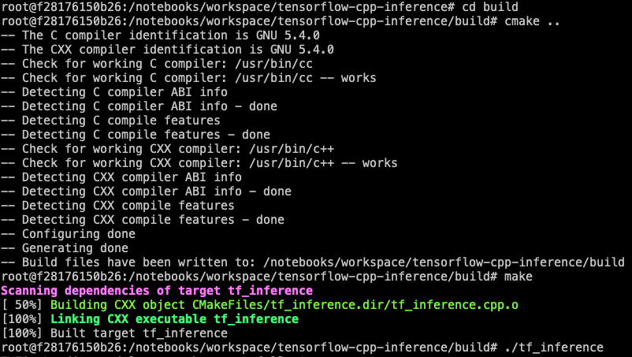

# Tensorflow C++ MNIST inference example

## Overview

A MNIST inference example, using Tensorflow C++ API. We use openCV to read image.

## Build and run

Modify ```CMakeLists.txt``` .

Set line 7 ```link_directories(...)``` according to  your local lib path. This lib path must include ```libtensorflow_cc.so```, ```libtensorflow_framework.so``` and other openCV lib files like this:

```shell
root@f28176150b26:/usr/local/lib# ls
bazel                          libopencv_objdetect.so        libprotobuf-lite.so.15
libcryptopp_utils.so           libopencv_objdetect.so.3.4    libprotobuf-lite.so.15.0.0
libopencv_calib3d.so           libopencv_objdetect.so.3.4.4  libprotobuf-lite.so.17
libopencv_calib3d.so.3.4       libopencv_photo.so            libprotobuf-lite.so.17.0.0
libopencv_calib3d.so.3.4.4     libopencv_photo.so.3.4        libprotobuf.a
libopencv_core.so              libopencv_photo.so.3.4.4      libprotobuf.la
libopencv_core.so.3.4          libopencv_shape.so            libprotobuf.so
libopencv_core.so.3.4.4        libopencv_shape.so.3.4        libprotobuf.so.14
libopencv_dnn.so               libopencv_shape.so.3.4.4      libprotobuf.so.14.0.0
libopencv_dnn.so.3.4           libopencv_stitching.so        libprotobuf.so.15
libopencv_dnn.so.3.4.4         libopencv_stitching.so.3.4    libprotobuf.so.15.0.0
libopencv_features2d.so        libopencv_stitching.so.3.4.4  libprotobuf.so.17
libopencv_features2d.so.3.4    libopencv_superres.so         libprotobuf.so.17.0.0
libopencv_features2d.so.3.4.4  libopencv_superres.so.3.4     libprotoc.a
libopencv_flann.so             libopencv_superres.so.3.4.4   libprotoc.la
libopencv_flann.so.3.4         libopencv_video.so            libprotoc.so
libopencv_flann.so.3.4.4       libopencv_video.so.3.4        libprotoc.so.14
libopencv_highgui.so           libopencv_video.so.3.4.4      libprotoc.so.14.0.0
libopencv_highgui.so.3.4       libopencv_videoio.so          libprotoc.so.15
libopencv_highgui.so.3.4.4     libopencv_videoio.so.3.4      libprotoc.so.15.0.0
libopencv_imgcodecs.so         libopencv_videoio.so.3.4.4    libprotoc.so.17
libopencv_imgcodecs.so.3.4     libopencv_videostab.so        libprotoc.so.17.0.0
libopencv_imgcodecs.so.3.4.4   libopencv_videostab.so.3.4    libpython3.6m.a
libopencv_imgproc.so           libopencv_videostab.so.3.4.4  libtensorflow_cc.so
libopencv_imgproc.so.3.4       libprotobuf-lite.a            libtensorflow_framework.so
libopencv_imgproc.so.3.4.4     libprotobuf-lite.la           pkgconfig
libopencv_ml.so                libprotobuf-lite.so           python2.7
libopencv_ml.so.3.4            libprotobuf-lite.so.14        python3.5
libopencv_ml.so.3.4.4          libprotobuf-lite.so.14.0.0    python3.6
```

Set line 13 - 18, pointing to your include path.

Build and run.

```shell
cd build
cmake ..
make
./tf_inference
```




